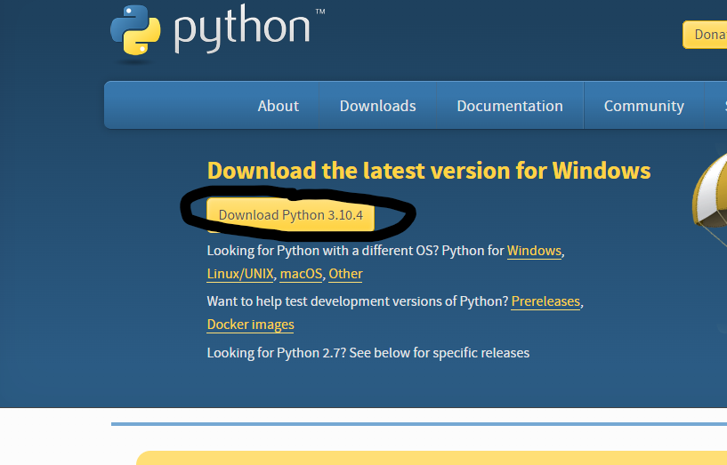
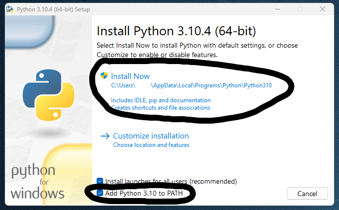
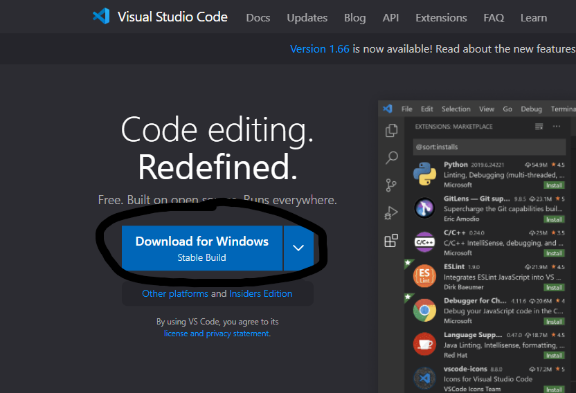
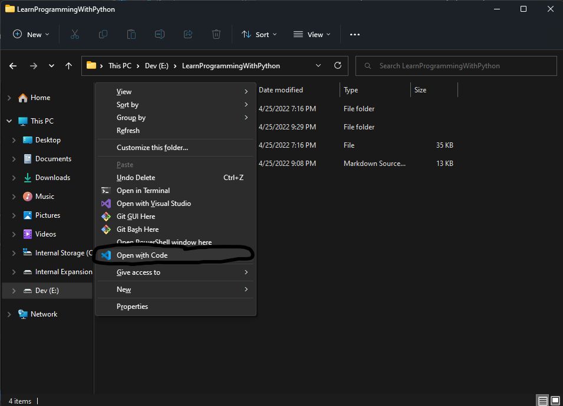
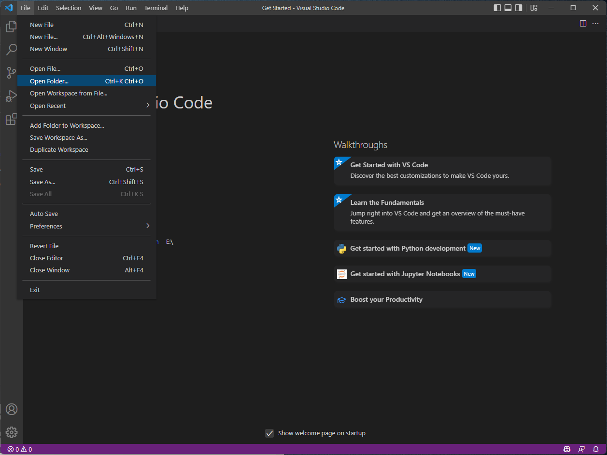
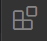
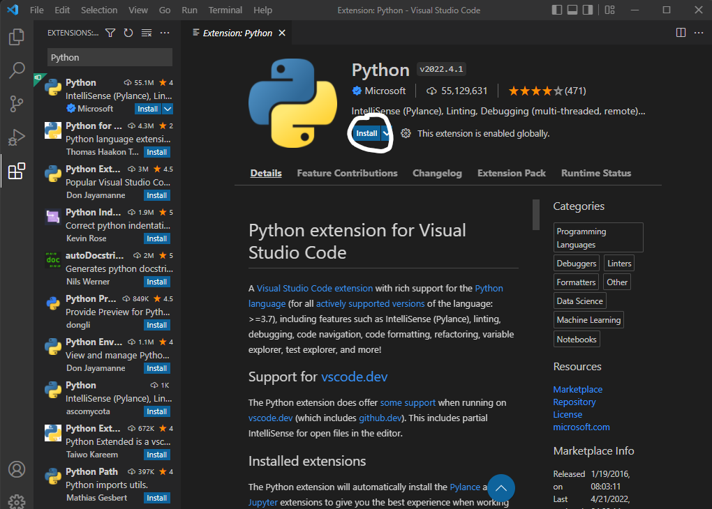
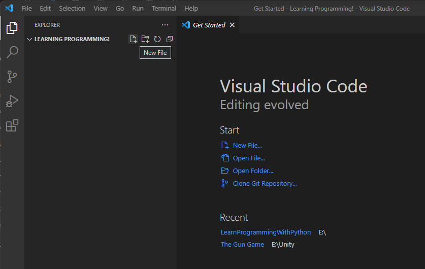
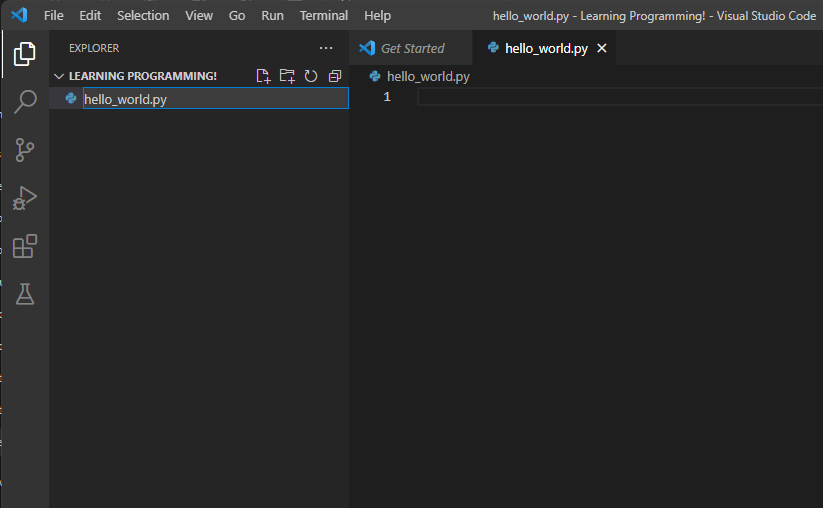
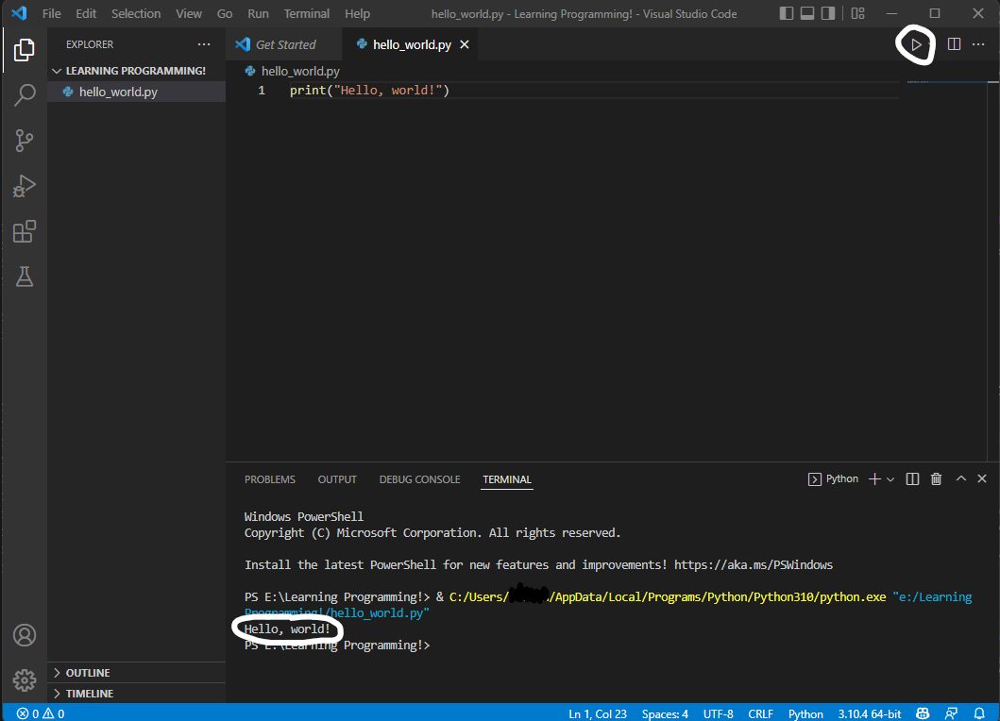

# Lesson 1: Setting up our development environment

## Index

* [But first, what is a development environment?](#but-first-what-is-a-development-environment)
* [Python installation](#python-installation)
  * [Why Python?](#why-python)
  * [Installing](#installing)
  * [Testing Python installation](#testing-python-installation)
* [Visual Studio Code Installation](#visual-studio-code-installation)
  * [Installing](#installing-1)
  * [Testing VS Code installation](#testing-vs-code-installation)
    * [Easy way](#easy-way)
    * [Other way](#other-way)
* [Visual Studio Code Extensions](#visual-studio-code-extensions)
* [Putting it all together: Hello World!](#putting-it-all-together-hello-world)
* [Congratulations!](#congratulations)

## But first, what is a development environment?

A development environment is the setup where we write our code, the tools we use, and the compilers or interpreters for the language. For our development environment, we will install Python and Visual Studio Code.

## Python installation
---
I will walk through every step of installing Python 3.10.4 now. Most newer versions of Python will work fine, however, so feel free to use a more recent version if one exists.

Quick disclaimer: Everything I do in this guide, I use a Windows PC for. I do not have access to a Mac, so some steps may differ for Mac users. If you are running Linux, I will assume that you are familiar with your respective package manager and will be able to install these tools on your own. If you are a Mac user and would like to contribute to make this guide complete for Mac users as well, by all means make an issue and I'll respond to it! Same goes for Linux!

### Why Python?
---
Python is dynamically typed language, which means that we won't have to tell Python what type a variable is. That variable can also be reassigned to hold a different type of value.

Python is also fairly beginner friendly and readable. Python is mostly friendly to the user, and gives us a fair amount of detail about errors. It is often easier to read Python code than, say, JavaScript code. Python was designed to be more readable.

Python is also highly cross-platform. Almost always, when we write code on one system, it works really well on another without having to change the code. This makes it really easy when learning to program.

Python can also be used for such a wide variety of things. From machine learning to web servers, there isn't much that Python can't do. There is a huge community and numerous libraries to help us do all sorts of different things. You can even use Python to make a simple game.

Python also supports multiple different programming paradigms. This just means that Python will let us use multiple different programming strategies.

### Installing
---
Head on over to Python's [downloads](https://www.python.org/downloads/) site. Here you should be able to download the latest version of Python.

Go ahead and click the download button. Once it downloads, launch the installer. From here, make sure to click on the box to add Python 3.10 to PATH! I'll explain what this means later, but for now just make sure it is enabled. Now click the install now option. Make sure to allow Python to make changes to your device when you are prompted.

You are now able to close the installer once it has fully installed.

### Testing Python installation
---

To make sure that Python was installed correctly, open your terminal. On Windows 10/11, this can be done by pressing the Windows key, and then typing `cmd` and pressing enter.

Inside the terminal, enter the following commands:

* `py --version` or `python --version` or `python3 --version`
  * Depending on your OS, some versions of this command may or may not work. Please verify that *at least one* of the commands successfully displays the current Python version.

* `pip --version` or `python3 -m pip --version`
  * If the first option doesn't work, pip may not have been properly added to the PATH when installing Python. This is okay, as long as you can access it using the second command. Pip is what is called a package manager. We will discuss pip in a later lesson. For now, just verify that it works. Substitute `python3` with whichever version of the Python command works on your machine. For example, I use `py` instead, since it is shorter and works on my machine.

If you were able to see the version of both pip and Python using at least one of the respective commands, then congradulations! Python is successfully installed! If not, you may have to do some troubleshooting, or try reinstalling!

## Visual Studio Code Installation
---

Now let's install a great text-editor for writing Python code. Any text editor should work just fine, even the built in Notepad on Windows! But VS Code has some really handy features that make life a lot easier for us when we write code.

### Installing
---

Go ahead to [Visual Studio Code's page.](https://code.visualstudio.com/) Download VS Code.

Walk through the installer (default options should do nicely) until you get the the following page.

It is **optional** but ***recommended*** that you check those two circled boxes. This is really handy for opening code from the file explorer. If these options don't appear for you, it's ok, it isn't necessary.

You may also check the box next to "Create a desktop icon" if you so desire.

Proceed to install. Once it has finished installing, you may close the installer.

### Testing VS Code installation
---
Now let's make sure it is installed correctly. Whenever we use VS Code, we will want to have it open in a folder. There are a couple ways to do this. First, I'll show you the easy way, but this only works if you checked the "Open with Code" checkboxes.

#### Easy way

First, navigate to some folder on your computer where you would like to store all your files related to this guide. From there, right click on empty space in the file explorer and click the button shown below. On Windows 11, you may have to press "Show more options" for it to show.

This method is really easy and instantly opens Visual Studio Code in the desired folder.

#### Other way

The other method is to first, open Visual Studio. Then select File > Open folder. Now select the folder you'd like to keep your programs in.

The bottom bar of Visual Studio Code should now be blue instead of Purple! Congrats, you have successfully installed VS Code!

## Visual Studio Code Extensions

For programming with Python, I would suggest installing the Python extension.

On the left side, there should be a button like this: . Click on it, and search for `Python`. Install the extension by Microsoft.

Great! This extension adds some handy features to VS Code for programming in Python.

## Putting it all together: Hello World!

Now let's verify that everything was installed and works well together!

With your folder open in VS Code, go ahead and create a new fild named `hello_world.py`. Make sure to include the `.py` file extension, or else VS Code won't know that it is a Python script!

Now in the editor that just opened, type in the following:

`print("Hello, world!")`

Now save the file with either ctrl+s (or cmd+s) or File > Save. Up in the top right corner, you should see a little play button. Press that button. A terminal, similar to the terminal we used earlier, should appear at the bottom. After a sec, the terminal should display `Hello, world!`

## Congratulations!

You just got your development environment all set up and wrote your very first Python program! For some of you this didn't take long, and for some of you it may have taken hours of troubleshooting! The good news is, the difficult setup process is now done, and you are ready to learn!

[Go to next lesson](../L2/L2.md)

[Go back to Chapter 1 page](../Chapter1.md)